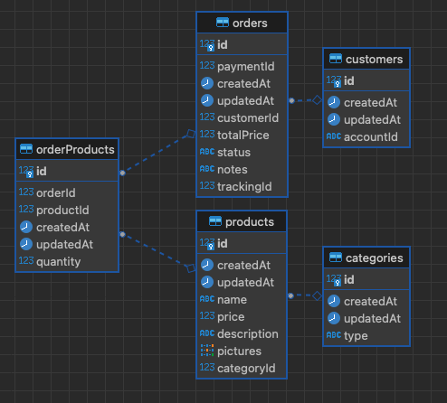

## Tech Challenge 7Soat - Database

### Postgres + RDS

As a well-established and highly robust relational database, PostgreSQL fits perfectly in a scenario involving multiple interrelated entities, such as the CRUD APIs in our application.

The relational structure facilitates maintaining integrity between tables, which is crucial when dealing with operations involving products, orders, and customers. The support for ACID transactions ensures that the system's critical operations are carried out reliably, even in cases of concurrency or occasional failures.

Moreover, using Amazon RDS to manage PostgreSQL in the cloud removes the complexity of handling backups, updates, and scalability. This allows us to focus on application development without worrying about infrastructure. With the high availability and automated replicas that RDS offers, the system gains an extra layer of resilience, which is essential in production.

When compared to the other technologies studied:

- **MongoDB** and **Cassandra** are great for handling large volumes of unstructured data or for scenarios involving massive reads and writes without dependencies between entities. However, our application is relational and would not benefit from these features.
- **Redis** is excellent as an in-memory database, but its strength lies in caching and fast key-value operations. This type of optimization is not necessary for our case.
- **Neo4J**, being a graph-oriented database, would be overkill for what we need. We do not have a scenario with complex data relationships, as is typical in social networks or recommendation systems.

In summary, PostgreSQL with RDS offers the perfect balance between performance, ease of management, and suitability for our system’s relational model, without adding unnecessary complexity to the infrastructure.

### Data Modeling

### Authors

- _Rafael Santos Monte (RM355045)_
- _Thiago Thalison Firmino de Lima (RM354998)_
- _Vitor Manoel da Silveira (RM355029)_
